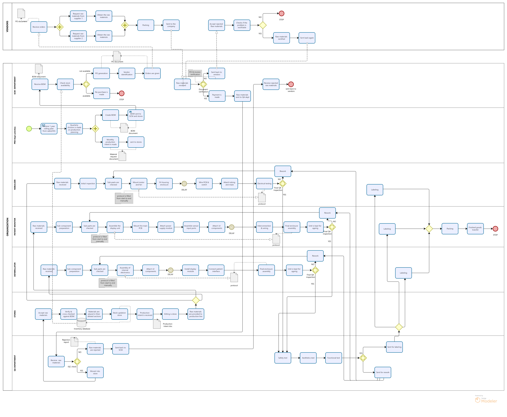
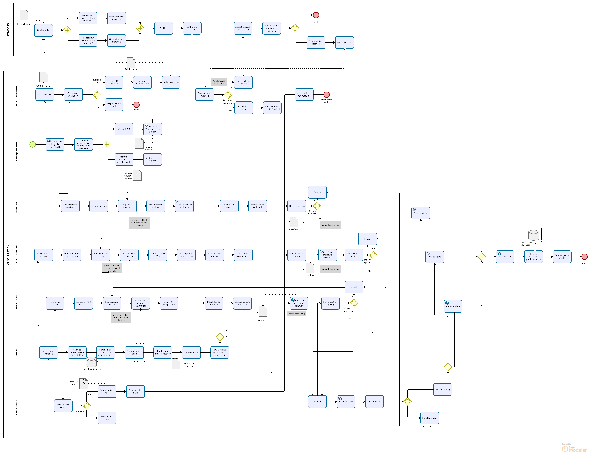

# 🏭 Business Process Mapping – BPL Medical Technologies Pvt. Ltd.

> Mapping and analyzing core operational processes across Production, Supply Chain, Stores, Quality Assurance, and Vendor Management to identify inefficiencies and propose improvements.

---

## 📌 Project Overview

This project was completed as part of an **internship and academic study** at **BPL Medical Technologies Pvt. Ltd.**, a leading Indian manufacturer of medical equipment and healthcare solutions.

The objective was to document and analyze the organization's existing business processes (AS-IS), identify bottlenecks and gaps, and propose an optimized future-state model (TO-BE) using standard Business Process Mapping techniques.

---

## 🏢 About the Organization

**BPL Medical Technologies Pvt. Ltd.** is one of India's most recognized names in medical devices, producing equipment such as ECG machines, patient monitors, defibrillators, and other critical healthcare products. The company follows complex multi-department workflows that span manufacturing, procurement, quality control, and vendor coordination.

---

## 🎯 Objectives

- Understand and document the current (AS-IS) processes across key departments
- Identify inefficiencies, redundancies, and communication gaps
- Design an improved (TO-BE) process model with streamlined workflows
- Present findings through structured process diagrams and a detailed report

---

## 🗂️ Departments / Processes Covered

| Department | Focus Area |
|---|---|
| **Production / Manufacturing** | Production planning, work orders, shop floor operations |
| **Supply Chain** | Inbound logistics, material flow, procurement coordination |
| **Stores** | Inventory management, material receipt, issue tracking |
| **Quality Assurance (QA)** | Inspection checkpoints, quality gates, non-conformance handling |
| **Vendor Management** | Vendor onboarding, purchase orders, delivery follow-up |

---

## 📂 Repository Contents

| File | Description |
|---|---|
| `AS-IS.png` | Current state process diagram showing existing workflows |
| `TO-BE.png` | Future state process diagram with proposed improvements |
| `REPORT BPL.pdf` | Full project report with analysis, findings, and recommendations |

---

## 🔄 AS-IS vs TO-BE

### AS-IS (Current State)
The AS-IS diagram captures how processes currently operate across departments — including manual handoffs, approval delays, and siloed communication between Production, QA, Stores, and Vendors.

### TO-BE (Future State)
The TO-BE diagram presents a redesigned workflow that addresses the identified gaps — with clearer process ownership, reduced redundancies, and more integrated cross-department coordination.

---

## 🛠️ Tools & Methodology

- **Bizagi Modeler** – Used for creating BPMN (Business Process Model and Notation) diagrams
- **BPMN 2.0 Standard** – Industry-standard notation for process mapping
- **Qualitative Analysis** – Interviews and observations with department stakeholders
- **Gap Analysis** – Comparing AS-IS and TO-BE to quantify improvement areas

---

## 🔍 Key Findings

- Identified manual bottlenecks in the material requisition and approval flow between Stores and Production
- QA inspection steps were not consistently integrated into the production workflow, leading to rework loops
- Vendor communication lacked a standardized process, causing delays in procurement cycles
- Proposed a unified material tracking flow across Supply Chain and Stores to reduce duplication

---

## 📄 Report

The full analysis, methodology, process narratives, and recommendations are documented in:

📎 [`REPORT BPL.pdf`](REPORT%20BPL.pdf)

---

## 👩‍💼 Author

**Anjana Babu**
Business Analysis Intern | BPL Medical Technologies Pvt. Ltd.
🔗 [LinkedIn](https://www.linkedin.com/in/anjana-babu-79911b2aa)
🐙 [GitHub](https://github.com/anjana-2802)

---

## 📌 Topics

`business-process-mapping` `bpmn` `bizagi` `process-improvement` `supply-chain` `manufacturing` `quality-assurance` `internship` `bpl-medical`
